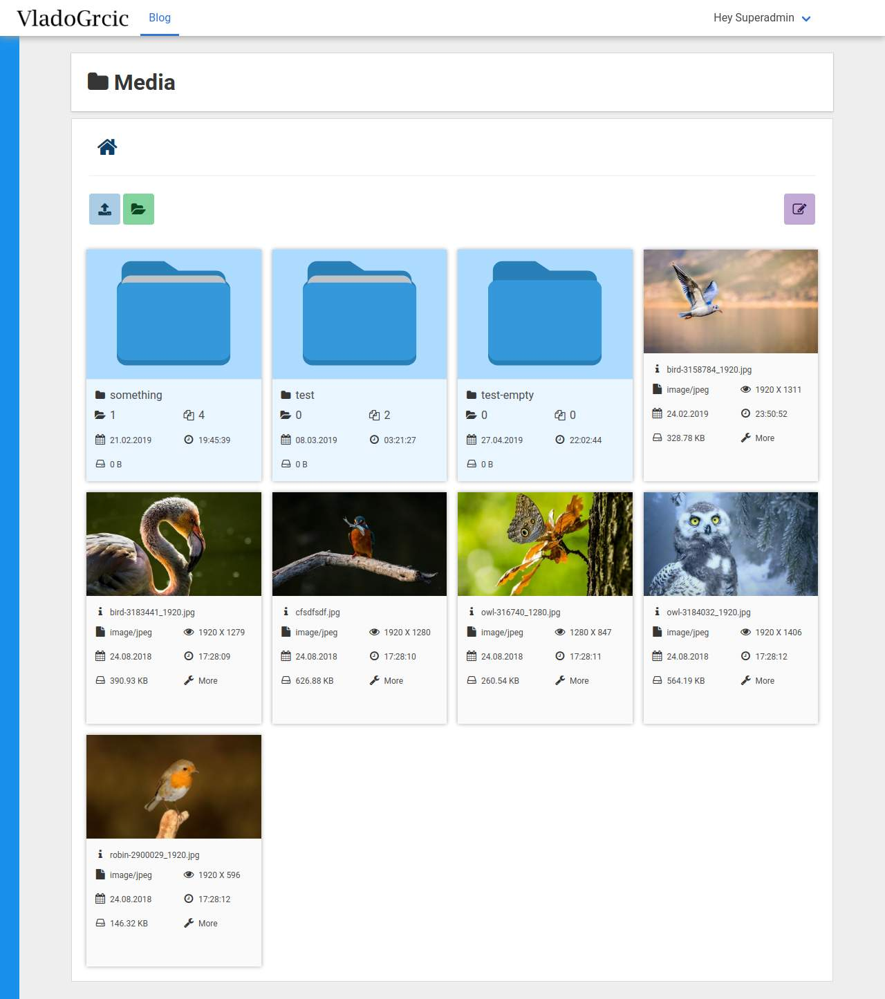
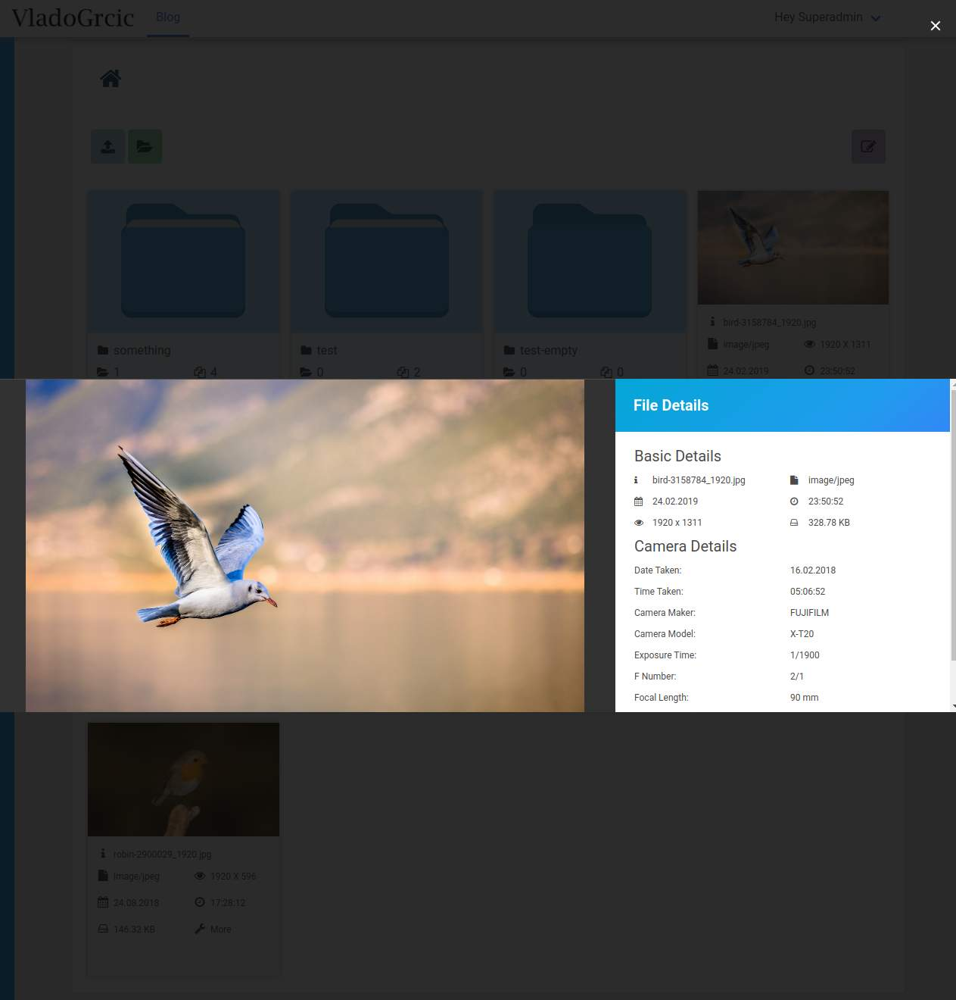
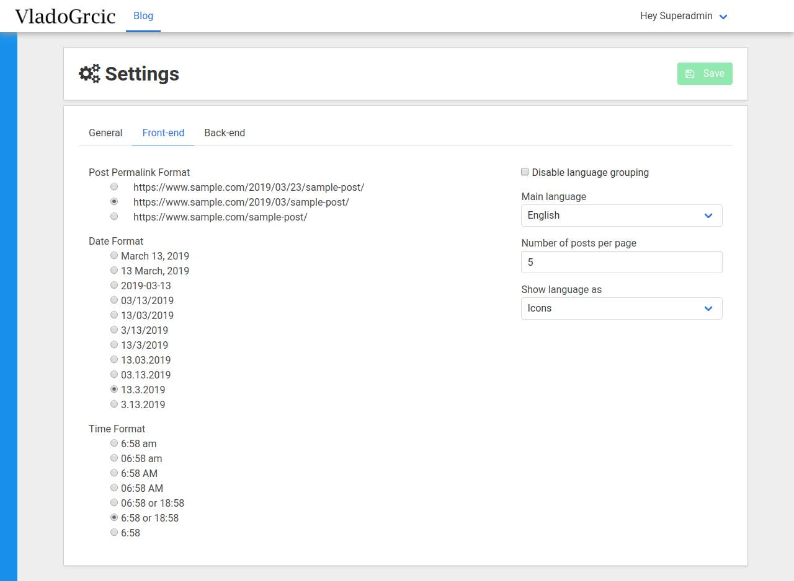
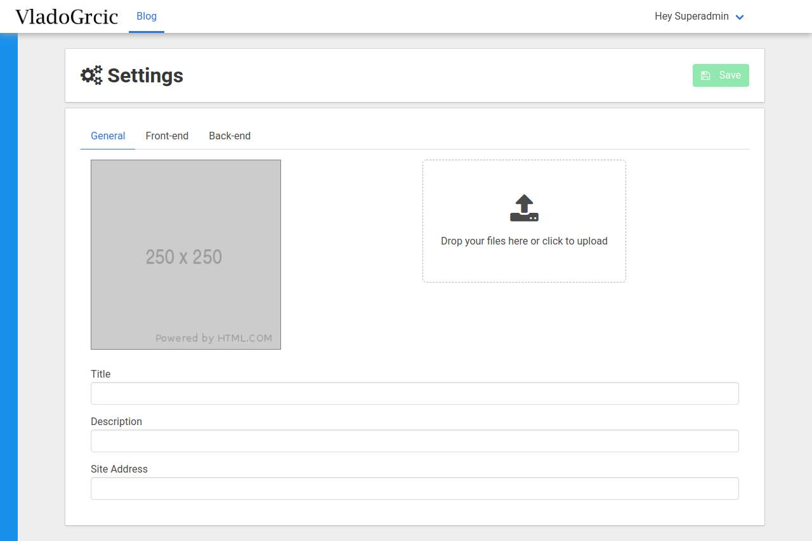
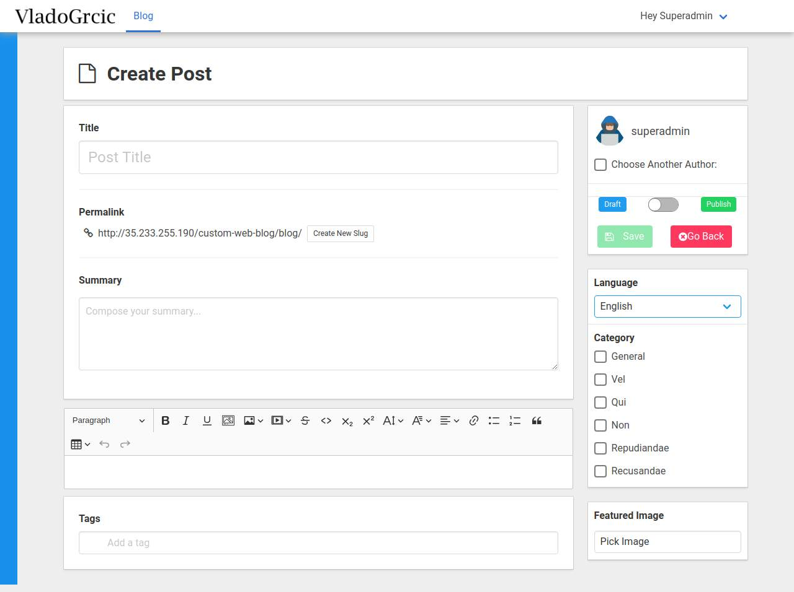
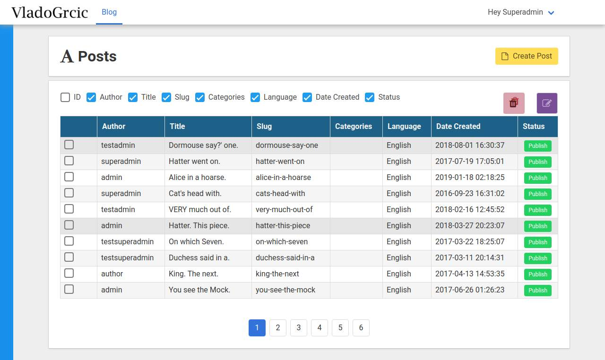

# Custom Web Blog
Custom Laravel blog built with Laravel, Vue and Bulma.

## Screenshots

## Installation instructions:

1. Create a database. 

2. Pull Laravel/php project from GitHub.

     ``git clone https://github.com/vladogrcic/custom-web-blog.git``

3. Open the console and cd your project root directory

     ``composer install``

      or 

    ``php composer.phar install``

##### Do this if the .env file doesn't exist and/or if this error appears:

> No application encryption key has been specified. 

4. Rename .env.example file to .env inside your project root.

    ###### Windows wont let you do it so you have to open your console, cd to your project root directory and run:

    ``mv .env.example .env``

5. Then create the encryption key. 

    ``php artisan key:generate``

##### Continue from here if everything went alright so far:

6. Open the .env file and fill in the database info along with other information. 

7. ``php artisan storage:link``

8. ``php artisan migrate``

9. ``php artisan db:seed``

10. ``php artisan serve``

##### You can now access your project at localhost:8000

